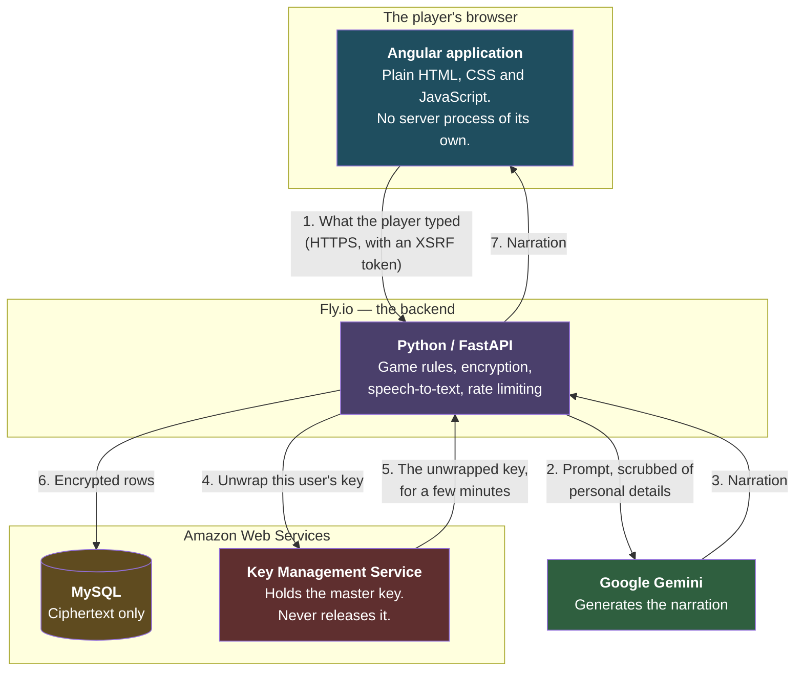
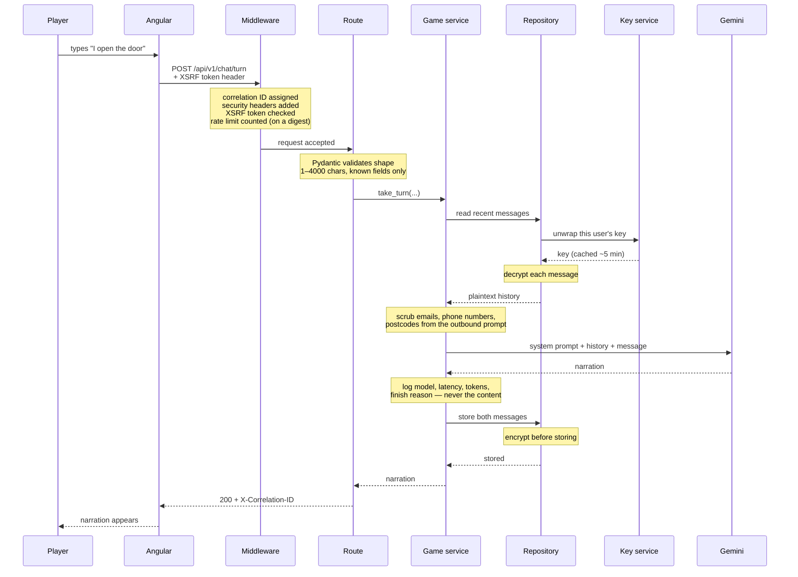
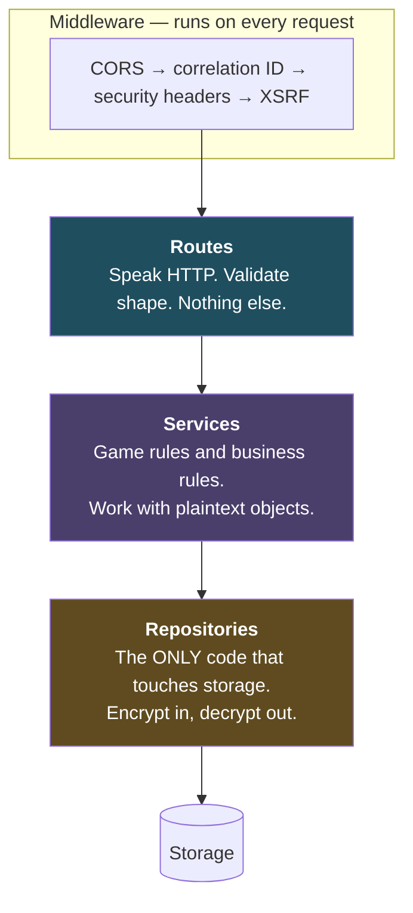
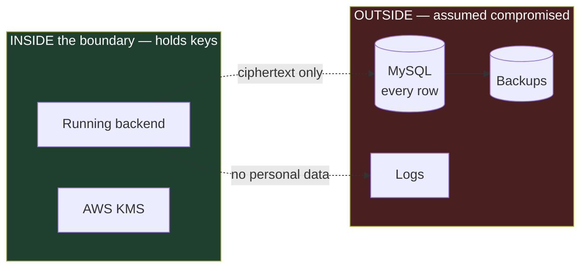
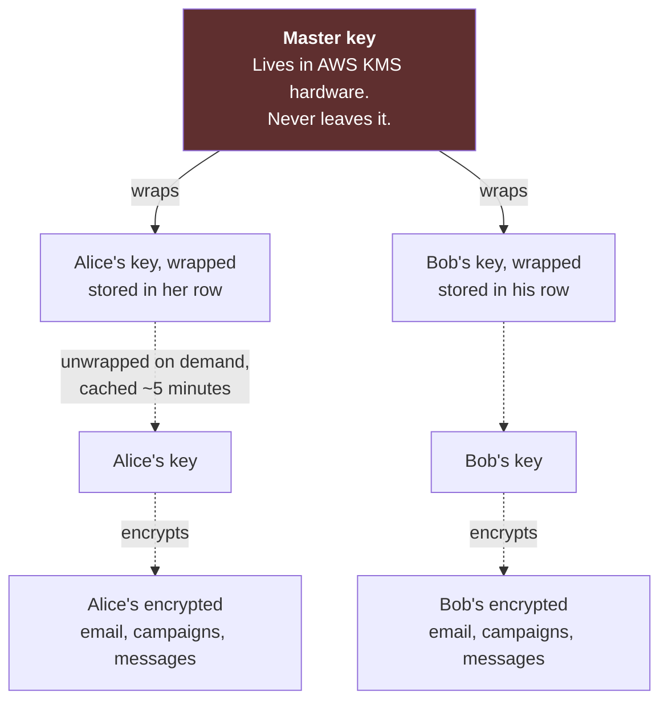
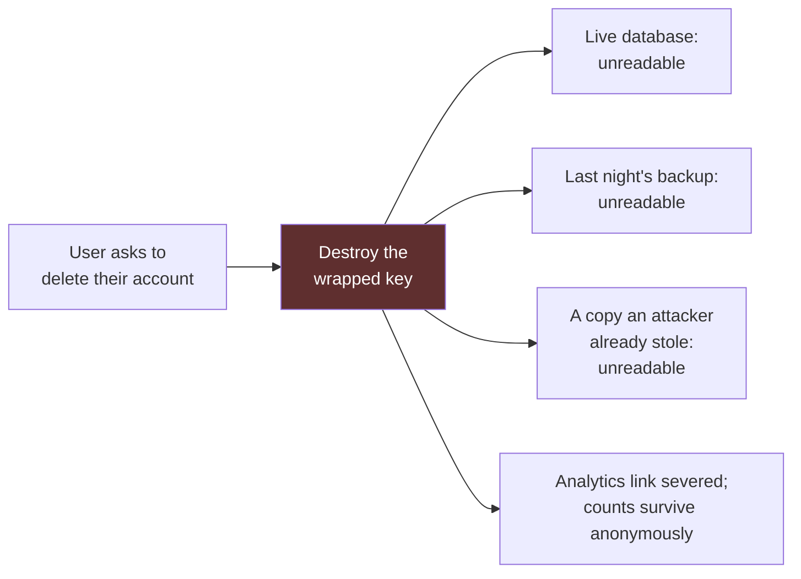
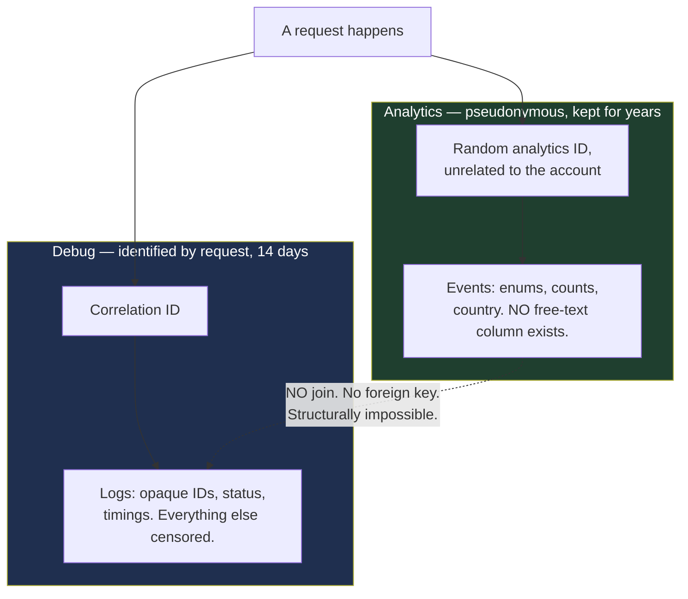
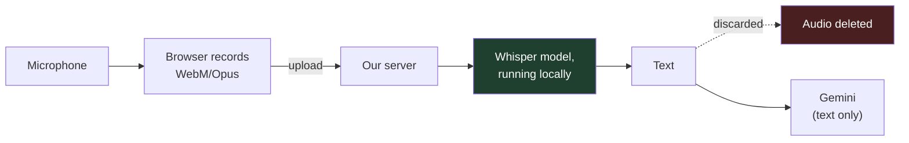

# Architecture

**Read this when** you want to understand how the whole system fits together —
what the pieces are, what talks to what, and where the important boundaries
are. It covers both halves of the project at once. For *why* each choice was
made, see [Architecture Decisions](docs/ARCHITECTURE_DECISIONS.md). For how to
run it, see [RUNNING.md](RUNNING.md).

The diagrams below are written in Mermaid, which GitHub and most editors render
as pictures automatically. If you are looking at raw text, they will appear as
indented code — the labelled arrows still read sensibly.

---

## The shape of the whole thing

There are three separate pieces, deliberately, run by three different
companies. Today they all run on your laptop; in production they are apart.

**Why three separate providers rather than one box?** It was a fixed
requirement of the project, but it also forces three things to be right from
day one instead of being discovered on deployment day: the frontend must build
to plain files with no server, the two halves must handle being on different
web addresses, and the backend must reach a database in someone else's network.
Each of those is painful to retrofit and cheap to design in.

**In Phase 1**, the AWS column does not exist. The database is replaced by an
in-memory store and the key service by a development key in a file. The
encryption code that uses them is real and runs on every request.

---

## The backend is one program

The three boxes above are three **tiers** — a browser, a server, a database.
That is not the same thing as microservices.

**The backend itself is a single monolithic application**: one FastAPI app, one
container, one process, one deployment. No queue, no broker, no gateway, no
service calling another service. The internal structure described further down
consists of layers inside that one program, connected by ordinary function
calls.

This is deliberate. One thing to deploy, one set of logs, one place a request
can fail. See
[the backend architecture](backend/docs/ARCHITECTURE.md) for the full
reasoning.

---

## What each piece is responsible for

| Piece | Does | Never does |
|---|---|---|
| **Angular app** | Draws the interface, records audio, holds the conversation on screen | Talk to Google. Hold an API key. See any encryption key. |
| **Python backend** | Game rules, all AI calls, all encryption, transcription, rate limiting | Store anything personal in readable form. Log anything personal. |
| **MySQL** | Store rows and find them fast | Hold a key. See plaintext. Join a person to their analytics. |
| **AWS KMS** | Guard the master key; wrap and unwrap per-user keys | Release the master key to anybody, ever |
| **Google Gemini** | Turn a prompt into narration | Receive audio. Receive an unscrubbed prompt. |

---

## One turn, from key press to narration

This is the path taken every time a player says something. Follow the numbers.

**The two moments that matter most** are the ones easiest to miss:

- **The scrub, before the prompt leaves.** Everything sent to Google leaves
  your control. On the free tier Google's terms permit them to use it for
  product improvement and say human reviewers may read it. So structured
  personal data is stripped first.
- **The encryption, inside the repository.** It happens on the way into
  storage, not in the database. Plaintext never travels to the database server,
  so it cannot appear in a query log.

---

## The layers inside the backend, and the rule that governs them

**Dependencies point one way only.** A route may call a service; a service may
call a repository; nothing calls backwards.

That is not tidiness for its own sake. It puts encryption at a **choke point**.
Because the repository is the only door to storage, it is impossible to save a
user's email without passing through the code that encrypts it. Correctness
stops depending on whether whoever writes the next endpoint remembers.

---

## The trust boundary — what an attacker actually gets

The whole privacy design assumes one specific adversary: **someone who obtains
a complete copy of the database.** A leaked backup, a stolen snapshot, a
compromised read replica, a dishonest administrator.

**What the attacker can read:** usernames, display names, timestamps, counters,
and fixed values like "level 4 rogue" or "horror tone". Also that two accounts
share an email address — without learning what it is.

**What they cannot read:** email, phone, names, dates of birth, IP addresses,
campaign titles, character names, backstories, or a single word of any
conversation. All of it is ciphertext, and the keys are not in the database and
are not derivable from anything in it.

**Stated plainly, because a security claim with unstated exceptions is not a
claim:** this does **not** defend against someone who compromises the running
application server itself, because that server necessarily holds keys while it
is working. That is a different and much harder attack. It also does not
protect anything already sent to Google.

---

## How encryption actually works

Each user has their own key. Think of their data as papers in a locked box.

The per-user key is stored **next to the data it opens**, but in wrapped form —
locked inside a second lock only KMS can open. That is the "envelope". An
attacker with the database gets ciphertext plus a wrapped key they cannot
unwrap.

**Why per user rather than one key for everything?** Because of what it makes
possible next.

---

## Deletion, which is the payoff

**The data is never touched.** What is destroyed is the one key that can read
it — and at that instant every encrypted byte belonging to that person becomes
permanently unreadable, everywhere it exists at once, including places nobody
can reach into and edit. Not hidden. Not flagged deleted. Mathematically
unrecoverable, by us as much as by anyone.

This is called crypto-shredding, and it is the reason the whole system uses a
key per user rather than one key for everything.

The analytics link is severed in the same operation. Their past activity keeps
contributing to totals, but nothing can ever attribute it to a person again —
so the business metrics survive a deletion that is nevertheless complete.

---

## Telemetry: two systems that never meet

Two rules make this work rather than merely describe it:

- **The analytics schema has no free-text column anywhere.** Not "we agree not
  to put text there" — there is physically nowhere for it to land, so a
  careless change cannot smuggle a player's message in.
- **Logs use an allowlist, not a blocklist.** A field not explicitly declared
  safe is replaced with a description of its type and length, like
  `<str:len=24>`. A field invented tomorrow is protected today, without anyone
  remembering to add it.

**How you actually debug.** Reading a user's rows is not available — they are
encrypted, and that is the point. Instead every response carries an
`X-Correlation-ID`. The user quotes it, you search the logs for it, and you see
the entire life of that one request. If you genuinely must decrypt someone's
data, it takes a stated reason, expires in an hour, is recorded permanently,
and **appears in that user's own visible activity log.** If we look, they are
told.

---

## Voice, and why it takes the long way round

The browser has built-in speech recognition that would make all of this
unnecessary — but in Chrome it streams the raw microphone audio to Google,
which would put a recording of the user's voice, and their room, outside the
boundary. So audio goes to our own server, is transcribed by a model running
there, and is discarded.

**The honest tension:** the resulting text does go to Google, because that is
the product. Text and audio are not equivalent, though. Text can be scrubbed of
names, inspected, and reasoned about. A recording cannot be scrubbed — it
carries the speaker's identity in its waveform whatever the words are.

**It costs about five dollars a month**, because transcription is computation
and it now happens on our machine rather than Google's. See
[COSTS](docs/COSTS.md).

---

## Where to read next

| You want to know | Read |
|---|---|
| Why each choice was made | [Architecture decisions](docs/ARCHITECTURE_DECISIONS.md) |
| How to run it | [RUNNING.md](RUNNING.md) |
| The database tables in detail | [Backend database reference](backend/docs/DATABASE.md) |
| How encryption is implemented | [Backend security](backend/docs/SECURITY.md) |
| The frontend's internals | [Frontend architecture](frontend/docs/ARCHITECTURE.md) |
| Getting a Gemini key and its limits | [Gemini](backend/docs/GEMINI.md) |
| Deploying it | [System guide](SYSTEM_GUIDE.md) |
| What a word means | [Glossary](docs/GLOSSARY.md) |
