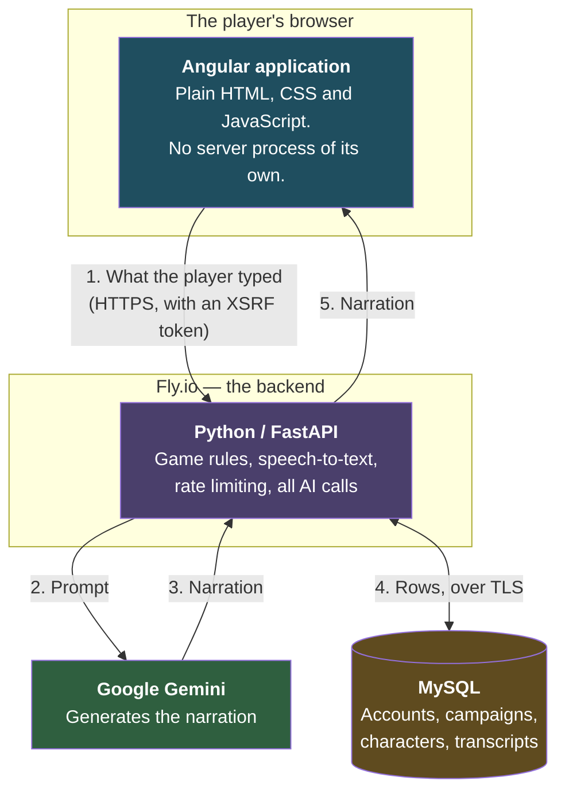
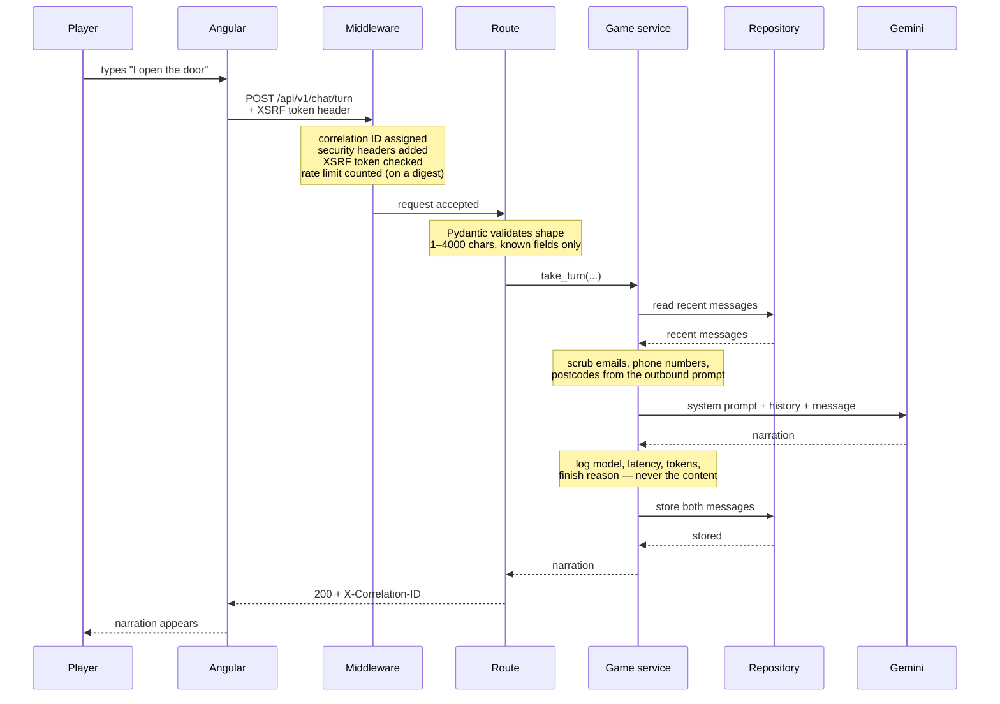
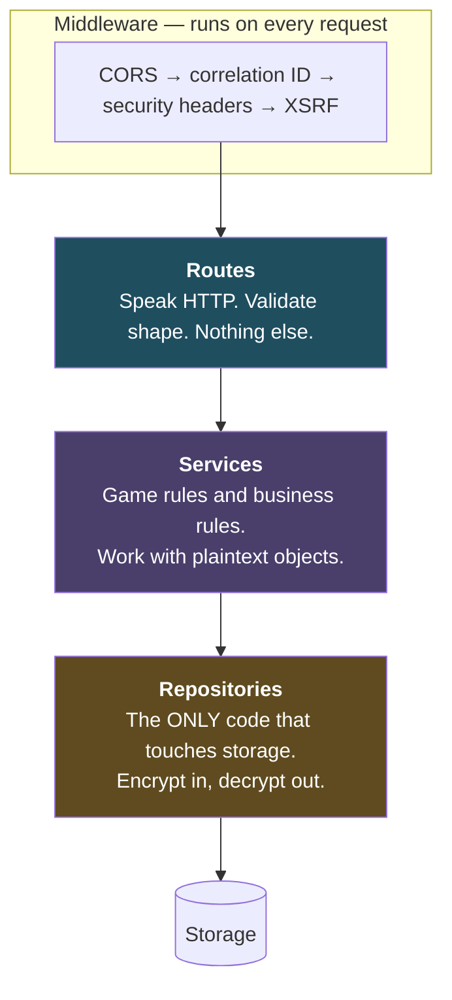
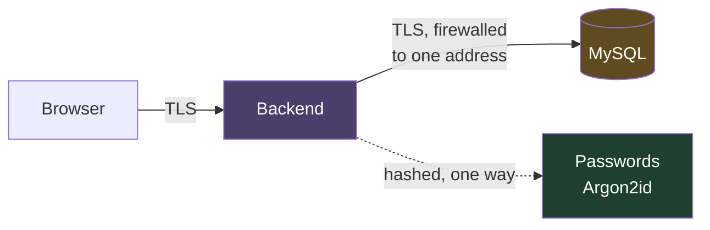
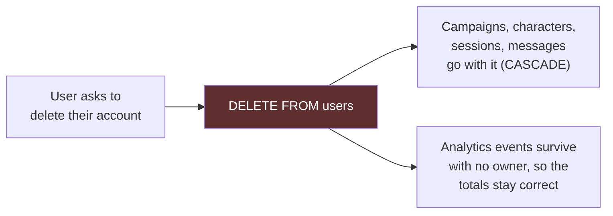
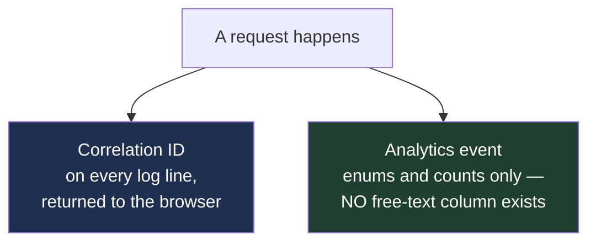
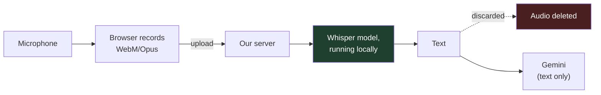

# Architecture

**Read this when** you want to understand how the whole system fits together —
what the pieces are, what talks to what, and where the important boundaries
are. It covers both halves of the project at once. For *why* each choice was
made, see [Architecture Decisions](docs/ARCHITECTURE_DECISIONS.md). For how to
run it, see [RUNNING.md](RUNNING.md).

The diagrams below are written in Mermaid, which GitHub and most editors render
as pictures automatically. If you are looking at raw text, they will appear as
indented code — the labelled arrows still read sensibly.

---

## The shape of the whole thing

There are three separate pieces, deliberately, run by three different
companies. Today they all run on your laptop; in production they are apart.

**Why three separate providers rather than one box?** It was a fixed
requirement of the project, but it also forces three things to be right from
day one instead of being discovered on deployment day: the frontend must build
to plain files with no server, the two halves must handle being on different
web addresses, and the backend must reach a database in someone else's network.
Each of those is painful to retrofit and cheap to design in.

**By default the database is not there either.** `REPOSITORY_BACKEND=memory`
keeps everything in Python dictionaries, so the application runs with nothing
installed. Set it to `mysql` when you want data to survive a restart —
[docs/LOCAL_MYSQL.md](docs/LOCAL_MYSQL.md) walks through installing it.

---

## The backend is one program

The three boxes above are three **tiers** — a browser, a server, a database.
That is not the same thing as microservices.

**The backend itself is a single monolithic application**: one FastAPI app, one
container, one process, one deployment. No queue, no broker, no gateway, no
service calling another service. The internal structure described further down
consists of layers inside that one program, connected by ordinary function
calls.

This is deliberate. One thing to deploy, one set of logs, one place a request
can fail. See
[the backend architecture](backend/docs/ARCHITECTURE.md) for the full
reasoning.

---

## What each piece is responsible for

| Piece | Does | Never does |
|---|---|---|
| **Angular app** | Draws the interface, records audio, holds the conversation on screen | Talk to Google. Hold an API key. See any encryption key. |
| **Python backend** | Game rules, all AI calls, transcription, rate limiting | Log a password or a token. Trust input without validating it. |
| **MySQL** | Store rows and find them fast | Be reachable from anywhere but the backend |
| **Google Gemini** | Turn a prompt into narration | Receive audio |

---

## One turn, from key press to narration

This is the path taken every time a player says something. Follow the numbers.

**The two moments that matter most** are the ones easiest to miss:

- **The scrub, before the prompt leaves.** Everything sent to Google leaves
  your control. On the free tier Google's terms permit them to use it for
  product improvement and say human reviewers may read it. So structured
  personal data is stripped first.
- **The ownership check, inside the repository.** Every read includes the
  owner in the query rather than checking afterwards, so another account's
  campaign simply does not come back.

---

## The layers inside the backend, and the rule that governs them

**Dependencies point one way only.** A route may call a service; a service may
call a repository; nothing calls backwards.

That is not tidiness for its own sake. It means storage decisions live in one
place: swapping the in-memory store for MySQL changes only the classes in that
folder, and no service or endpoint is aware it happened. It is also where every
ownership check lives, so "can this account see this row?" is answered once
rather than in every endpoint.

---

## How data is protected

There is no application-layer encryption. Personal data is stored as readable
values, and protected by controlling who can reach it.

| Layer | What it does |
|---|---|
| **Argon2id password hashing** | Passwords are never stored and cannot be recovered by anybody |
| **TLS everywhere** | Nobody on the network path can read or alter traffic |
| **Firewall on the database** | Only the backend's address can connect |
| **Limited database user** | The application can read and write rows, but cannot `DROP` or `ALTER` anything |
| **Provider disk encryption** | Defends against physical theft of the disks |
| **Ownership in every query** | One account cannot read another's rows by guessing an identifier |

**Stated plainly, because a security claim with unstated exceptions is not a
claim: anyone who can query the database can read email addresses and
conversations.** The protection is access control, not scrambled contents. That
makes the database credentials the thing that matters most.

Passwords are the exception. They are one-way fingerprints — no query, no tool
and no amount of time turns them back, for an attacker or for you.

This is a deliberately conventional posture, chosen so one person can run it.
[ADR-002](docs/DECISIONS_PRIVACY.md) records what was considered and rejected,
and [PRIVACY.md](PRIVACY.md) has a section on what adding encryption would
involve if this ever holds something more sensitive.

---

## Deletion

One statement. `ON DELETE CASCADE` in the schema takes everything belonging to
the account, so there can be no orphaned rows — which a hand-written cleanup
routine can leave behind the first time somebody adds a table and forgets.

**One honest limitation:** this does not reach into database backups. A backup
taken before the deletion holds the rows until it ages out.

---

## Telemetry

**How you debug.** Every response carries an `X-Correlation-ID`, shown on error
screens. The user quotes it, you search the logs, and you see the whole life of
that one request. Faster than finding their account, and it works when you do
not know who they are.

**What analytics can hold.** Enumerated values, numbers, booleans and
timestamps. There is physically no free-text column, so a careless change later
cannot start recording what players typed.

**What logs keep out.** Credential-shaped fields are replaced with
`<redacted>`, and request bodies are never logged. The rule the codebase
follows is *log identifiers, not contents*.

---

## Voice, and why it takes the long way round

The browser has built-in speech recognition that would make all of this
unnecessary — but in Chrome it streams the raw microphone audio to Google,
which would put a recording of the user's voice, and their room, outside the
boundary. So audio goes to our own server, is transcribed by a model running
there, and is discarded.

**The honest tension:** the resulting text does go to Google, because that is
the product. Text and audio are not equivalent, though. Text can be scrubbed of
names, inspected, and reasoned about. A recording cannot be scrubbed — it
carries the speaker's identity in its waveform whatever the words are.

**It costs about five dollars a month**, because transcription is computation
and it now happens on our machine rather than Google's. See
[COSTS](docs/COSTS.md).

---

## Where to read next

| You want to know | Read |
|---|---|
| Why each choice was made | [Architecture decisions](docs/ARCHITECTURE_DECISIONS.md) |
| How to run it | [RUNNING.md](RUNNING.md) |
| The database tables in detail | [Backend database reference](backend/docs/DATABASE.md) |
| How encryption is implemented | [Backend security](backend/docs/SECURITY.md) |
| The frontend's internals | [Frontend architecture](frontend/docs/ARCHITECTURE.md) |
| Getting a Gemini key and its limits | [Gemini](backend/docs/GEMINI.md) |
| Deploying it | [System guide](SYSTEM_GUIDE.md) |
| What a word means | [Glossary](docs/GLOSSARY.md) |
