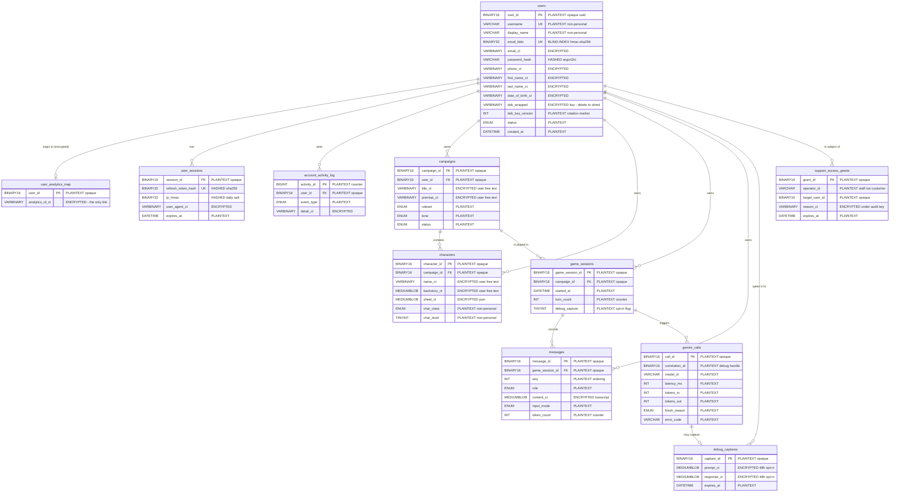
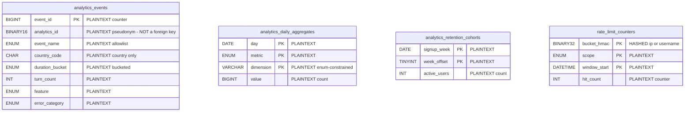

# Database — Schema Reference

**Read this when** you need to know what tables exist, what each column holds,
and — most importantly — how each column is protected. For how to *use* the
database (queries, stored procedures, migrations, permissions), read
[DATABASE_OPERATIONS.md](DATABASE_OPERATIONS.md) instead.

The authoritative definition is the SQL itself, in
[`migrations/0001_initial_schema.sql`](../migrations/0001_initial_schema.sql).
Every column there carries a `COMMENT` declaring its classification, so the
classification travels with the database and cannot drift away from this
document. If the two ever disagree, the SQL is right and this file is stale —
fix it in the same commit.

**Phase 1 note.** None of this is connected yet. The schema is designed in full
and the migrations are written and runnable, but the application uses an
in-memory store (see
[ADR-013](../../docs/DECISIONS_PLATFORM.md)). The encryption code that will
protect these columns is real and running today.

---

## The four classifications

Every column in the database is exactly one of these. There is no fifth
category and no "it depends".

| Classification | What it means | Can it be read from a stolen dump? | Can it be searched? |
|---|---|---|---|
| **PLAINTEXT** | Stored as written. | Yes | Yes |
| **ENCRYPTED** | AES-256-GCM ciphertext under a key unique to one user. | No | No |
| **HASHED** | One-way digest. The original is gone forever. | No | Only by comparing a fresh guess |
| **BLIND-INDEX** | Keyed one-way fingerprint, stable so it can be indexed. | No | Yes, for exact matches |

**PLAINTEXT is only permitted for data that is not personal.** In this product
that means: opaque random identifiers, usernames, display names, counters,
timestamps, and values from a fixed enumerated list. Nothing a person typed,
and nothing that identifies them outside the application.

---

## What a stolen database dump would reveal

This is the honest inventory. An attacker with a complete copy of every table
learns exactly this and nothing more:

- **Usernames and display names.** Readable. You classified these as
  non-personal, so they are stored as-is. If a user picks their real name as
  their display name, that is their disclosure, not the database's.
- **How many accounts exist, and when each was created.** Timestamps are
  plaintext.
- **The shape of activity**: how many campaigns, how many messages, how long
  each message was, whether it was typed or spoken, which character class was
  chosen, what tone a campaign uses.
- **Which accounts share an email address** — from equal blind index values —
  but not what any address is.
- **Nothing else.** No email, no name, no phone, no date of birth, no IP
  address, no message content, no character names, no backstories.

What the attacker cannot do, even with unlimited time: turn any ciphertext
column into readable text. The keys are not in the database. They are not
derivable from anything in the database.

---

## Entity relationship diagram

An *entity relationship diagram* shows tables as boxes and the links between
them as lines. `||--o{` means "one to many": one campaign has many characters.

Column names ending `_ct` hold ciphertext, `_bidx` a blind index, and `_hmac` a
digest.

The analytics tables are drawn separately below, because the fact that they
have **no line connecting them to `users`** is the entire point.

There is no foreign key from `analytics_events.analytics_id` to any table. That
absence is deliberate and load-bearing: the database is structurally incapable
of joining an event back to a person. Only the application, holding a user's
decryption key, can make that connection — and only for a user who has not been
deleted.

---

## Indexes, and why there are so few

An *index* is a lookup structure that makes searching a column fast. It is also
a second copy of that column's contents, sitting in a separate file. Indexing an
encrypted column would be pointless (ciphertext does not sort meaningfully);
indexing a plaintext personal column would quietly duplicate the very data the
design is trying to protect.

So the rule is: **no index on personal data except the blind index.**

| Table | Index | On | Why it is safe |
|---|---|---|---|
| `users` | `uq_users_username` | `username` | Plaintext by classification |
| `users` | `uq_users_email_bidx` | `email_bidx` | Blind index — the one permitted exception |
| `users` | `idx_users_created_at` | `created_at` | A timestamp |
| `campaigns` | `idx_campaigns_user` | `user_id, status, updated_at` | Opaque identifier plus enum and timestamp |
| `messages` | `uq_messages_session_seq` | `game_session_id, seq` | Opaque identifier plus an integer |
| `user_sessions` | `uq_sessions_token` | `refresh_token_hash` | A hash |
| `rate_limit_counters` | primary key | `bucket_hmac, scope, window_start` | A digest |
| `analytics_events` | `idx_ae_analytics` | `analytics_id, occurred_at` | Pseudonym, unlinkable without the encrypted map |

---

## Key rotation

Every encrypted row carries a `dek_key_version`. When the master key in AWS KMS
is rotated, existing rows keep their old version number and continue to decrypt
correctly, because KMS can still unwrap keys created under previous generations.
New writes use the new version.

This means rotation is instant and does not require touching a single existing
row. Re-encryption, if you ever want it, becomes a slow background job that
walks rows with an old version number at whatever pace you like — not an outage.

---

## Where the keys actually live

| Key | Purpose | Stored where | Reachable by the database? |
|---|---|---|---|
| KMS Customer Master Key | Wraps every user DEK | AWS KMS hardware | **No** |
| Per-user DEK | Encrypts one user's data | Wrapped, in `users.dek_wrapped` | Only in wrapped form |
| Blind index key | Fingerprints emails | AWS Secrets Manager | **No** |
| IP salt | Fingerprints addresses, rotates daily | Generated in memory, cached in Secrets Manager | **No** |
| Audit key | Encrypts support access reasons | AWS KMS, separate CMK | **No** |

Read that column again: nothing in it says "the database". That is the design.

---

## Related documents

- [DATABASE_OPERATIONS.md](DATABASE_OPERATIONS.md) — queries, stored
  procedures, migrations, and database permissions.
- [SECURITY.md](SECURITY.md) — how the encryption is actually implemented in
  code.
- [OBSERVABILITY.md](OBSERVABILITY.md) — the two telemetry planes in detail.
- [Privacy decisions](../../docs/DECISIONS_PRIVACY.md) — why any of this.
